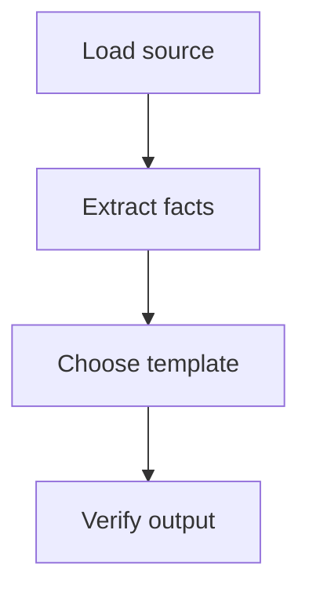
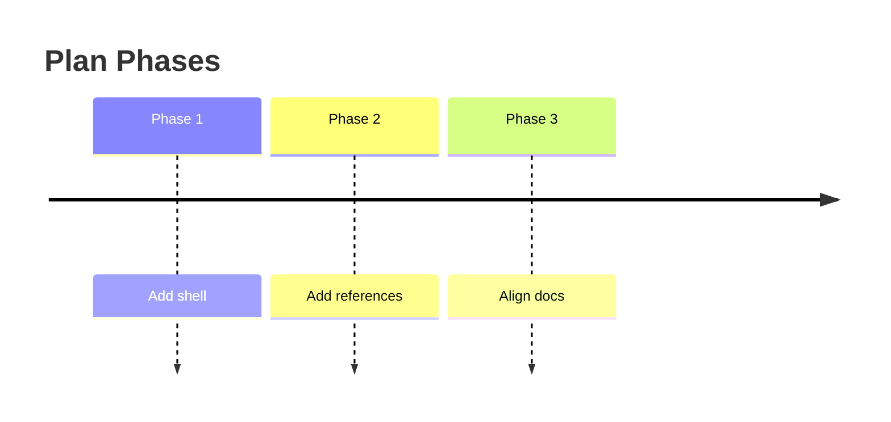
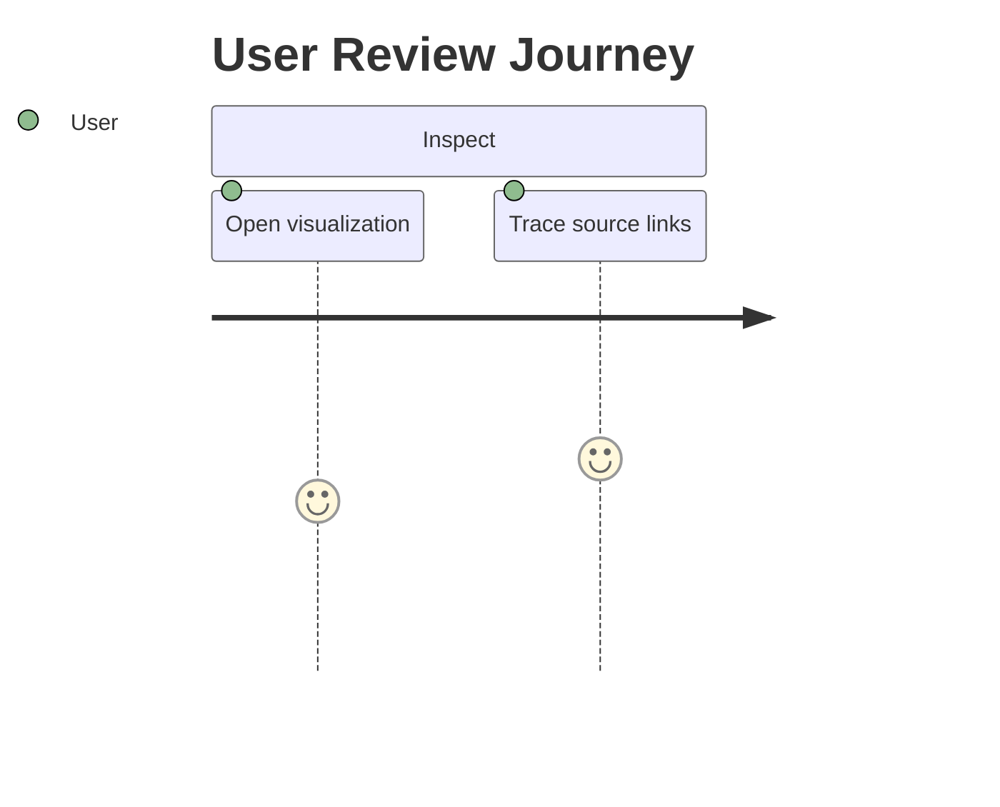
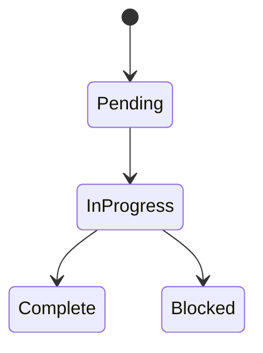
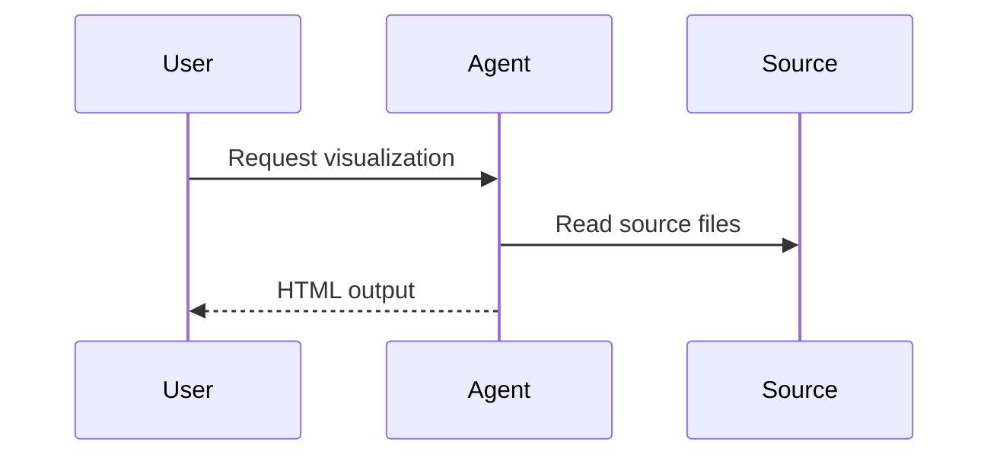
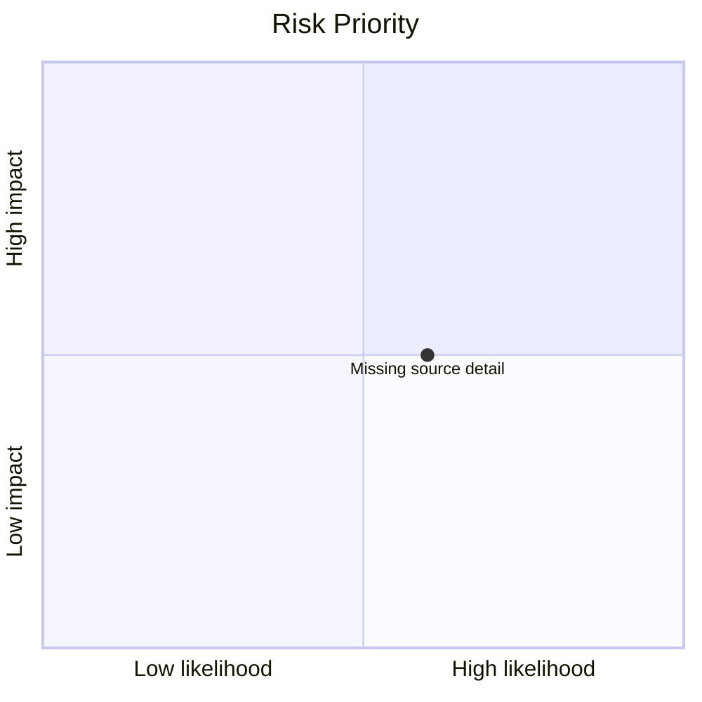

# Mermaid Recipes

Prefer several small diagrams over one dense diagram. Keep labels factual and short. Use Mermaid only when it reveals flow, timing, dependency, state, or interaction that the prose alone would make harder to inspect. If Mermaid syntax is uncertain, use a readable HTML/CSS block instead.

## Process Flow

## Timeline

## Journey

## Status Transitions

## Actor Or System Interaction

## Priority Or Risk Map

Use a table fallback for risk maps when labels are long or quadrant placement is not source-backed.

Do not use Mermaid just to mirror the source heading tree, restate a bullet list, or decorate a panel that already reads clearly without a diagram.
